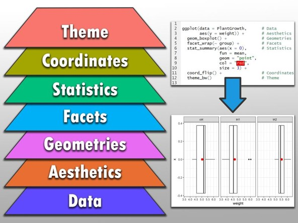

# Vorbereitungen
## Clear workspace
Löschen Sie die alte Umgebung, um in einem "neuen" R zu starten.
```{r}
rm(list=ls())
```

## Installieren von Packages
Falls Sie die in diesem Notebook benötigten Packages noch nicht haben (und nur dann), werden diese von CRAN noch nachinstalliert.
```{r}
if (!require("ggplot2")) install.packages("ggplot2")
if (!require("dplyr")) install.packages("dplyr") 
if (!require("export")) install.packages("export") 
if (!require("GGally")) install.packages("GGally") 
if (!require("magrittr")) install.packages("magrittr")
```

# Datenvisualisierung mit ggplot2

From: https://www.linkedin.com/feed/update/urn:li:activity:7258012305798447105/

# Data
## Daten laden und vorbereiten
Sie können die Daten aus dem Internet herunterladen, importieren und einem Preprocessing unterziehen. Wochentage, Arbeitstage, Datum und Wetterbedingungen sind folglich als passende Formate (Datum, Faktoren...) kodiert.
```{r}
library(dplyr)
bikesharing <- read.csv("https://raw.githubusercontent.com/christophM/interpretable-ml-book/master/data/bike-sharing-daily.csv")
bikesharing <- bikesharing %>%
  mutate(
    weekday_fct = factor(x = weekday,
             levels = c(0,1,2,3,4,5,6),
             labels = c("Sunday",
                       "Monday",
                       "Tuesday",
                       "Wednesday",
                       "Thursday",
                       "Friday",
                       "Saturday")))
bikesharing <- bikesharing %>%
    mutate(weathersit_fct = factor(x = weathersit,
              levels = c(1, 2, 3),
              labels = c("Good",
                       "Clouds/Mist",
                       "Rain/Snow/Storm")))
bikesharing <- bikesharing %>%
    mutate(season_fct = factor(x = season,
              levels = c(1, 2, 3, 4),
              labels = c("Spring",
                       "Summer",
                       "Fall",
                       "Winter")),
            month_fct = factor(x = mnth,
             levels = c(1,2,3,4,5,6,7,8,9,10,11,12),
             labels = c("January",
                       "February",
                       "March",
                       "April",
                       "May",
                       "June",
                       "July",
                       "August",
                       "September",
                       "October",
                       "November",
                       "December")))


bikesharing$workingday <- as.factor(bikesharing$workingday)
bikesharing$weekday <- as.factor(bikesharing$weekday)
bikesharing$dteday <- as.Date(bikesharing$dteday)
bikesharing$weekday_fct <- as.character(bikesharing$weekday_fct)
```

## Explorative Datenanalyse
### Übersicht über den Datensatz
Sehen Sie sich die ersten sechs Zeilen des Datensatzes an.
```{r}
head(bikesharing)
```

### Struktur
Sehen Sie sich Struktur und Aufbau des Datensatzes an
```{r}
str(bikesharing)
```

### Statistische Zusammenfassung
Erhalten Sie für jede Variable eine Zusammenfassung in Form deskriptiver Statistik
```{r}
summary(bikesharing)
```
### Pairs-Plot zur visuellen Übersicht
Plotten Sie alle Variablen gegeneinander, um Verteilungen und Zusammenhänge bereits jetzt zu verstehen
```{r fig.height = 10, fig.width = 10, fig.align = "center", warning=FALSE,message=FALSE}
library(GGally)
GGally::ggpairs(bikesharing[-c(2,17,18,19)])
```

### Pairs-Plot zur visuellen Übersicht
```{r fig.height = 10, fig.width = 10, fig.align = "center", warning=FALSE,message=FALSE}
library(tidyr)
bikesharing_ggally <- bikesharing %>% filter(yr==1) %>% select(temp,workingday,weekday,hum,windspeed,cnt)
library(GGally)
GGally::ggpairs(bikesharing_ggally)
```

# Aesthetics
## Datenvisualisierung mit ggplot2 - Logik in Layern
Der einfachste Plot, den wir mit dem Bikesharing-Datensatz machen können:
```{r}
ggplot(bikesharing, mapping=aes(x=dteday,y=cnt)) +
  geom_point()
```

## Anzahl täglich verliehener Räder über das Jahr
### Color
```{r }
ggplot(filter(bikesharing,yr==1), mapping=aes(x=dteday,y=cnt,color=weathersit_fct)) +
  geom_point()+
  #facet_grid(~as.factor(season))+
  labs(title="Bikesharing over the year 2012 with different weather conditions",x="Date",y="Count (abs)")
```

### Color
```{r}
ggplot(filter(bikesharing,yr==0), 
                mapping=aes(x=windspeed,
                            y=cnt,
                            )) +
  geom_point(aes(color=factor(weathersit_fct)))
```

### Shape
```{r}
ggplot(filter(bikesharing,yr==0), 
                mapping=aes(x=windspeed,
                            y=cnt
                            )) +
  geom_point(aes(shape=factor(season)))
```

### Size
```{r}
ggplot(filter(bikesharing,yr==0), 
                mapping=aes(x=windspeed,
                            y=cnt,
                            )) +
  geom_point(aes(size=temp))
```

### Labs (Labels)
```{r}
ggplot(filter(bikesharing,yr==0), 
                mapping=aes(x=windspeed,
                            y=cnt,
                            )) +
  geom_point(aes(color=factor(weathersit_fct))) +
  labs(title="Verteilung der numerischen Variablen",x="Windspeed",y="Count",subtitle = "Subtitle example",caption="Caption example\nwith new line")
```

# Geoms
## Density
### Density eine Gruppe
```{r}
ggplot(filter(bikesharing,yr==0), 
                mapping=aes(x=cnt
                            
                            )) +
  geom_density()+
  labs(title="Distribution of daily rentals over the year",
       x="Rentals",
       y="Frequency")
```

### Density mehrere Gruppen
```{r}
ggplot(filter(bikesharing,yr==0), 
                mapping=aes(x=cnt,fill=season_fct
                            )) +
  geom_density(alpha=0.5)+
  labs(title="Distribution of daily rentals in a month over the year",
       x="Rentals",
       y="Frequency")
```

### Ridgeline-Plot
```{r}
if (!require("hrbrthemes")) install.packages("hrbrthemes")
library(ggridges)
library(ggplot2)
library(viridis)
library(hrbrthemes)

bikesharing_temp <- filter(bikesharing,yr==0)
# Plot
ggplot(bikesharing_temp, aes(x = temp, y = factor(month_fct), fill = ..x..)) +
  geom_density_ridges_gradient(scale = 3, rel_min_height = 0.01) +
  scale_fill_viridis(name = "Temp. (AU)", option = "C") +
  labs(title="Temperatures in 2011",
       x="Temperature (norm.)",
       y="")+
  theme_ipsum() +
    theme(
      legend.position="none",
      panel.spacing = unit(0.1, "lines"),
      strip.text.x = element_text(size = 8)+theme(plot.title = element_text(hjust = 0.5))
    )
```

## Histogram
```{r}
ggplot(filter(bikesharing,yr==0), 
                mapping=aes(x=cnt
                            
                            )) +
  geom_histogram(fill="#AAA39D")+
  labs(title="Distribution of daily rentals over the year",
       x="Rentals",
       y="Frequency")
```

## Boxplot
### Simple Boxplot
```{r}
ggplot(filter(bikesharing,yr==0), mapping=aes(x=weathersit_fct,y=cnt,fill=weathersit_fct)) +
   stat_boxplot(geom = 'errorbar',width = 0.2)+
  geom_boxplot(show.legend = FALSE)+
 
  labs(title="Distribution of daily rentals",
       x="Weather condition",
       y="Rentals")
```


### Multiple layers and geoms
```{r}
ggplot(filter(bikesharing,yr==0), mapping=aes(x=weathersit_fct,y=cnt,fill=weathersit_fct)) +
   stat_boxplot(geom = 'errorbar',width = 0.2)+
  geom_boxplot(show.legend = FALSE)+
  geom_jitter(position = position_jitter(w = 0.4, h = 0.1),show.legend = FALSE) +
 
  labs(title="Distribution of daily rentals",
       x="Weather condition",
       y="Rentals")
```


### Violin plot
```{r}
ggplot(filter(bikesharing,yr==0), mapping=aes(x=weathersit_fct,y=cnt,fill=weathersit_fct),show.legend = FALSE) +
  geom_violin(outlier.shape = NA,show.legend = FALSE)+
  geom_jitter(position = position_jitter(w = 0.4, h = 0.1),show.legend = FALSE) +
  labs(title="Distribution of daily rentals",
       x="Weather condition",
       y="Rentals")
```

### Raincloud plot
```{r}
ggplot(filter(bikesharing,yr==0), mapping=aes(x=weathersit_fct,y=cnt,fill=weathersit_fct),show.legend = FALSE) +
  
  ggdist::stat_halfeye(aes(),adjust=0.6,justification=-.05,.width=0,point_colour= NA,show.legend = FALSE)+
  geom_jitter(show.legend = FALSE,color="#575756",size=1,position = position_jitter(w = 0.1, h = 0.1))+

labs(title="Distribution of daily rentals",
       x="Weather condition",
       y="Rentals")
```

## Bar plot
Now, let's create a barplot which summarizes the number of rented bikes per month in the second year. For this, we have to do some calculations first:
```{r}
library(dplyr)
bikesharing_monthly <- bikesharing %>% select(season,yr,mnth,month_fct,weathersit_fct,cnt) %>% filter(yr==1) %>% group_by(mnth,month_fct) %>% dplyr::summarize(mnth_sum_cnt=sum(cnt))
print(bikesharing_monthly)
```

```{r}
ggplot(bikesharing_monthly, aes(x = as.factor(mnth), y=mnth_sum_cnt)) + 
    geom_col(fill="#AAA39D",show.legend = FALSE) + labs(x="Month", y="Rentals",title="Rentals per month")
```


```{r}
ggplot(bikesharing_monthly, aes(x = as.factor(month_fct), y=mnth_sum_cnt)) + 
    geom_col(fill="#AAA39D",show.legend = FALSE) + labs(x="Month", y="Rentals",title="Rentals per month")
```

```{r}
ggplot(bikesharing_monthly, aes(x = as.factor(month_fct), y=mnth_sum_cnt)) + 
    geom_col(fill="#AAA39D",show.legend = FALSE) + labs(x="Month", y="Rentals",title="Rentals per month") +
  coord_flip()
```

## Scatter plot
Anzahl täglich verliehener Räder über das Jahr
```{r }
ggplot(filter(bikesharing,yr==1), mapping=aes(x=dteday,y=cnt)) +
  geom_point()+
  labs(title="Bikesharing over the year 2012",x="Date",y="Count (abs)")
```

## Error indicators
Daily rentals per month
```{r}
bikesharing_dailyaverage <- bikesharing %>% filter(yr==1) %>% group_by(month_fct) %>% dplyr::summarize(mean=mean(cnt),sd=sd(cnt))
```

```{r}
ggplot(bikesharing_dailyaverage , aes(x=month_fct, y=mean)) + 
  geom_errorbar(aes(ymin=mean-sd, ymax=mean+sd), width=.3) +
  geom_point(size=2)+
  labs(title="Average Daily Rentals",
       x="Month",
       y="Mean")+
  coord_flip()
```

```{r}
ggplot(bikesharing_dailyaverage , aes(x=month_fct, y=mean)) + 
  geom_bar( aes(x=month_fct, y=mean), stat="identity", fill="#AAA39D") +
  geom_errorbar(aes(ymin=mean-sd, ymax=mean+sd), size=1,width=.3,color="#DF4807") +
  
  labs(title="Average Daily Rentals",
       x="Month",
       y="Mean")+
  coord_flip()
```

Durchschnittstemperatur jeden Monat
```{r}
bikesharing_dailyaveragetemperature <- bikesharing %>% filter(yr==1) %>% group_by(month_fct) %>% dplyr::summarize(meancnt=mean(cnt),sdcnt=sd(cnt),meantemp=mean(temp),sdtemp=sd(temp))
```

```{r}
ggplot(bikesharing_dailyaveragetemperature, 
                mapping=aes(x=meantemp,
                            y=meancnt
                            )) +
  geom_point(aes(color=month_fct))+
  geom_errorbar(aes(ymin = meancnt-sdcnt, ymax = meancnt+sdcnt,color=month_fct)) + 
  geom_errorbarh(aes(xmin = meantemp-sdtemp, xmax = meantemp+sdtemp,color=month_fct))+
  #geom_smooth()+
  labs(title="Temperature and daily rentals",
       x="Temperature (mean)",
       y="Count (mean)")
```

```{r}
ggplot(bikesharing_dailyaveragetemperature, 
                mapping=aes(x=meantemp,
                            y=meancnt
                            )) +
  geom_point(aes(color=month_fct))+
  geom_errorbar(aes(ymin = meancnt-sdcnt, ymax = meancnt+sdcnt,color=month_fct)) + 
  geom_errorbarh(aes(xmin = meantemp-sdtemp, xmax = meantemp+sdtemp,color=month_fct))+
  geom_smooth()+
  labs(title="Temperature and daily rentals",
       x="Temperature (mean)",
       y="Count (mean)")
```


## Position
In particular barplots with different groups can be displayed in different ways. The groups can be either stacked onto each other or can be shown next to each other.

Calculate the number of bikes rented each month and transformation of the dataframe into the long format
```{r}
library(dplyr)
library(tidyr)
bikesharing_monthly_casual <- bikesharing %>% select(yr,mnth,casual,registered) %>% filter(yr==1) %>% group_by(mnth) %>% dplyr::summarize(mnth_sum_registered=sum(registered),mnth_sum_casual=sum(casual)) %>% 
  
  
  
  gather(
                        key = Type, # new column where old vector names are gathered
                        value = Measurement, #actual values from the old vectors gathered in one row
                        mnth_sum_registered,mnth_sum_casual) #vector or row names to be gathered
print(bikesharing_monthly_casual)
```
### Stack position
```{r}
ggplot(bikesharing_monthly_casual, aes(x = as.factor(mnth), y=Measurement, fill = Type)) + 
    geom_col(position = "stack") + 
  labs(x="Month", y="Rentals",title="Rentals per month")
```

### Dodge position:
```{r}
ggplot(bikesharing_monthly_casual, aes(x = as.factor(mnth), y=Measurement, fill = Type)) + 
    geom_col(position = "dodge") + 
  labs(x="Month", y="Rentals",title="Rentals per month")
```


## Geom smooth
```{r}
ggplot(filter(bikesharing,yr==0), mapping=aes(x=windspeed,y=cnt)) +
  geom_point()+
  geom_smooth()+
  labs(title="Wind und Ausleihen",x="Windgeschwindigkeit",y="Count (abs)")
```

## Marginal Plot Geom Rug: Visualisierung von Häufigkeit und Verteilung Ausleihen und Windgeschwindigkeiten
```{r}
ggplot(filter(bikesharing,yr==0), 
                mapping=aes(x=windspeed,
                            y=cnt,
                            )) +
  geom_point(aes(color=factor(weathersit_fct)))+
  geom_rug()+
  geom_smooth(se=FALSE)
```

## Marginal Plot Boxplot
```{r}
Abb <- ggplot(filter(bikesharing,yr==0), 
                mapping=aes(x=windspeed,
                            y=cnt,
                            )) +
  geom_point(aes(color=factor(weathersit_fct)))+
  geom_rug()+
  geom_smooth(se=FALSE)+
  labs(title="Wind und Ausleihen",
       x="Windgeschwindigkeit",
       y="Count (abs)")
  

library(ggExtra)
Abb <- ggMarginal(Abb, 
                    type = "boxplot", 
                    fill="transparent",
                    size=20)
Abb
```


# Facets
In ggplot2, faceting is a powerful feature that allows you to divide a single plot into multiple smaller plots based on the values of one or more categorical variables. Each small plot, often arranged in a grid, displays a subset of the data, making it easier to compare and analyze patterns across different categories. Faceting is a valuable tool for exploring complex datasets and presenting the information in a more organized and informative way.

Faceting is accomplished using the facet_grid() and facet_wrap() functions in ggplot2:
Weather and rentals facetted by season and weekday
## Facet grid
```{r}
ggplot(filter(bikesharing,yr==0), 
                mapping=aes(x=temp,
                            y=cnt,
                            )) +
  geom_point(aes(color=factor(weathersit_fct)))+
  facet_grid(season~weekday_fct)+
  labs(title="Weather and rentals by season and weekday",
       x="Temperature",
       y="Count (abs)")+
  theme(plot.title = element_text(hjust = 0.5,color="black",face="bold",size=16)) + 
  scale_color_brewer(palette="Dark2")
```

## Facet wrap
```{r}
ggplot(filter(bikesharing,yr==0), 
                mapping=aes(x=temp,
                            y=cnt,
                            )) +
  geom_point(aes(color=factor(weathersit_fct)))+
  facet_wrap(~weekday_fct)+
  labs(title="Weather and rentals by season and weekday",
       x="Temperature",
       y="Count (abs)")+
  theme(plot.title = element_text(hjust = 0.5,color="black",face="bold",size=16)) + 
  scale_color_brewer(palette="Dark2")
```

Text, Reihenfolge in Facet Labels und Legenden kann zusätzlich verändert werden (nicht gezeigt in diesem Notebook)

# Themes und Colors
## Themes
So far, you have seen ggplot standard optic. This means, that the visualization has not been customized yet and has not been optimized with regards to color palettes, fonts, font size, background, grid etc. 
This can be done using themes.
Themes contain information about the font, font size, orientation of the labels, color... Type the command ?theme to learn more about all theme options.

```{r}
ggplot(filter(bikesharing,yr==0), 
                mapping=aes(x=temp,
                            y=cnt,
                            )) +
  geom_point(aes(size=windspeed,shape=factor(holiday),color=factor(weathersit_fct)))+
  geom_smooth()+
  labs(title="Weather and rentals",
       x="Temperature",
       y="Count (abs)")+
  
  theme(
      plot.title = element_text(hjust = 0.5,color="black",face="bold",size=16),
      axis.title = element_text(size=12),
      axis.text = element_text(size=8),
      legend.title = element_text(size=8),
      legend.text = element_text(size=8),
      plot.background = element_rect(colour = "black", fill=NA, size=0.7))
```

There are some predefined themes in ggplot:
```{r}
ggplot(filter(bikesharing,yr==0), 
                mapping=aes(x=temp,
                            y=cnt,
                            )) +
  geom_point(aes(size=windspeed,shape=factor(holiday),color=factor(weathersit_fct)))+
  geom_smooth()+
  labs(title="Weather and rentals",
       x="Temperature",
       y="Count (abs)") + 
  theme_bw() + 
  theme(plot.title = element_text(hjust = 0.5)) # This line centers the title
```

Try different themes!
```{r}
ggplot(filter(bikesharing,yr==0), 
                mapping=aes(x=temp,
                            y=cnt,
                            )) +
  geom_point(aes(size=windspeed,shape=factor(holiday),color=factor(weathersit_fct)))+
  geom_smooth()+
  labs(title="Weather and rentals",
       x="Temperature",
       y="Count (abs)") + 
  theme_classic()
  theme(plot.title = element_text(hjust = 0.5)) # This line centers the title
```
```{r}
ggplot(filter(bikesharing,yr==0), 
                mapping=aes(x=temp,
                            y=cnt,
                            )) +
  geom_point(aes(size=windspeed,shape=factor(holiday),color=factor(weathersit_fct)))+
  geom_smooth()+
  labs(title="Weather and rentals",
       x="Temperature",
       y="Count (abs)") + 
  theme_void() + 
  theme(plot.title = element_text(hjust = 0.5)) # This line centers the title
```

You can even make your visualization look like in Excel...
```{r }
library(ggthemes)
ggplot(filter(bikesharing,yr==0), 
                mapping=aes(x=temp,
                            y=cnt,
                            )) +
  geom_point(aes(size=windspeed,shape=factor(holiday),color=factor(weathersit_fct)))+
  geom_smooth()+
  labs(title="Weather and rentals",
       x="Temperature",
       y="Count (abs)") + 
  theme_excel_new()
```

...international journals such as the wallstreet journal...
```{r}
ggplot(filter(bikesharing,yr==0), 
                mapping=aes(x=temp,
                            y=cnt,
                            )) +
  geom_point(aes(size=windspeed,shape=factor(holiday),color=factor(weathersit_fct)))+
  geom_smooth()+
  labs(title="Weather and rentals",
       x="Temperature",
       y="Count (abs)") + 
  theme_wsj()
```

...or the economist:
```{r}
ggplot(filter(bikesharing,yr==0), 
                mapping=aes(x=temp,
                            y=cnt,
                            )) +
  geom_point(aes(size=windspeed,shape=factor(holiday),color=factor(weathersit_fct)))+
  geom_smooth()+
  labs(title="Weather and rentals",
       x="Temperature",
       y="Count (abs)") + 
  theme_economist()
```

## Colors
### Col
```{r}
ggplot(filter(bikesharing,yr==0), mapping=aes(x=windspeed,y=cnt)) +
  geom_point(color="red")+
  geom_smooth(color="green")+
  labs(title="Wind und Ausleihen",x="Windgeschwindigkeit",y="Count (abs)")
```

### Fill
```{r}
ggplot(filter(bikesharing,yr==0), 
                mapping=aes(x=cnt
                            
                            )) +
  geom_histogram(fill="#AAA39D")+
  labs(title="Distribution of daily rentals over the year",
       x="Rentals",
       y="Frequency")
```

### Gradienten mit manuellen Stopps
```{r}
library(tidyverse)
library(lubridate)
bikesharing_splitdate <- bikesharing %>% mutate(date = ymd(dteday)) %>% 
  mutate_at(vars(date), funs(year, month, day)) %>% filter(yr==1)

ggplot(bikesharing_splitdate, aes(day, month_fct, fill= temp)) + 
  geom_tile() + 
  labs(title="Temperature",
       x="Day",
       y="Month")+
  scale_fill_gradient(low = "#00699A", high = "#9C0C35")
```


## Palettes
Sometimes, you might want to use your own color palettes, be it to put into practice a corporate design or be it to improve the legibility by adjusting the colors.
You can either create palettes on your own or use one of the many inbuilt color palettes. More can be loaded in additional packages so that you might be lucky and can avoid building own palettes.
You can use a predefined palette either for the color or for filling:
scale_colour_brewer() or scale_fill_brewer()
Within the function you can specify the palette you would like to use.
```{r}
library(RColorBrewer)
weatherandrentals <- ggplot(filter(bikesharing,yr==0), 
                mapping=aes(x=temp,
                            y=cnt,
                            )) +
  geom_point(aes(size=windspeed,shape=factor(holiday),color=factor(weathersit_fct)))+
  geom_smooth()+
  labs(title="Weather and rentals",
       x="Temperature",
       y="Count (abs)")+
  theme(plot.title = element_text(hjust = 0.5,color="black",face="bold",size=16)) + 
  
  scale_color_brewer(palette="Dark2")

print(weatherandrentals)
```
There are many more options to specify the color used for a palette, also for many colors. If you really need to specify your own colors and themes see: https://drsimonj.svbtle.com/creating-corporate-colour-palettes-for-ggplot2


# Sharing visualisations
## Abbildungen exportieren
### Export in Powerpoint
```{r}
library(export)
figurebikesharingmonthly <- ggplot(bikesharing_monthly, aes(x = as.factor(mnth), y=mnth_sum_cnt, fill = factor(mnth))) + 
    geom_col(show.legend = FALSE) + labs(x="Month", y="Rentals",title="Rentals per month")
figurebigkesharingmonthly
graph2ppt(file="exporttest.pptx", width=6.5, height=5) 
```

### ggsave
#### Save as a jpeg
```{r}
ggsave(file="bikesharingmonthly.jpeg",plot=figurebikesharingmonthly,width=5, height=4)
```

#### Save as a pdf
```{r}
ggsave(file="bikesharingmonthly.pdf",plot=figurebikesharingmonthly,device = "pdf",width=5, height=4)
```

#### Save as a svg
```{r}
ggsave(file="bikesharingmonthly.svg",plot=figurebikesharingmonthly,device = "svg",width=5, height=4)
```

## Demo SRH Corporate Design und Export
### Load function for SRH theme
```{r}
source("C:/Users/PrinzDrChristian(SRH/OneDrive - SRH Fernhochschule/Dokumente/R/SRHTemplate/srhcolorsandthemes.R", echo=FALSE)
# theme_srh() + scale_srh()
```

### Code figures in SRH look
```{r}
A <- ggplot(filter(bikesharing,yr==0), mapping=aes(x=dteday,y=cnt)) +
  geom_point() +
  labs(title="Rentals over the year",
       x="Date",
       y="Count (abs)") +
  theme_srh() + scale_color_srh(palette="3cols") +
  theme(
        axis.text.x=element_blank(),
        axis.ticks.x=element_blank())
```

```{r}
B <- ggplot(bikesharing_monthly, aes(x = as.factor(mnth), y=mnth_sum_cnt, fill = factor(mnth))) + 
    geom_col(show.legend = FALSE) + labs(x="Month", y="Rentals",title="Rentals per month") +
  theme_srh() + scale_fill_srh(palette = "12cols")
```

```{r}
C <- ggplot(filter(bikesharing,yr==0), mapping=aes(x=weathersit_fct,y=cnt,fill=weathersit_fct)) +
  geom_boxplot(show.legend = FALSE)+
  geom_jitter(show.legend = FALSE)+
  labs(title="Weather and rentals",x="Weather",y="Count (abs)") +
  theme_srh() + scale_fill_srh(palette = "3cols")
```

```{r}
D <- ggplot(filter(bikesharing,yr==0), 
                mapping=aes(x=temp,
                            y=cnt,
                            )) +
  geom_point(aes(size=windspeed,shape=factor(holiday),color=factor(weathersit_fct)))+
  geom_smooth(color="#DF4807")+
  labs(title="Weather and rentals",
       x="Temperature",
       y="Count (abs)") + 
  theme_srh() + scale_color_srh(palette="3cols")
```

### Patchplot
```{r fig.height = 10, fig.width = 10, fig.align = "center", warning=FALSE,message=FALSE}
library(patchwork)
patchplot <- (A/B/C/D) + plot_layout(ncol=2,widths=c(1,1))+
  plot_annotation(
  title = 'Bike rentals',
  theme = theme_srh(),
  tag_levels = 'A') & 
  theme(plot.tag = element_text(size = 10))
patchplot
graph2ppt(file="patchplot.pptx", width=13, height=10)
```


# To make sure the code ran completely
Wenn Ihr Code vollständig gelaufen ist, dann steht in der letzten Zeile in der Console (unten) der "Finalsatz".
```{r}
print("You are done with the guided example.")
```
